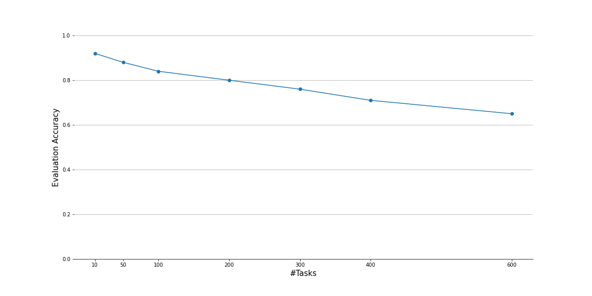

# Reset It and Forget It (ECAI 2024)

Official code for the [ECAI 2024](https://www.ecai2024.eu/) paper, **"Reset It and Forget It: Relearning Last-Layer Weights Improves Continual and Transfer Learning"**, by Lapo Frati, Neil Traft, Jeff Clune, and Nick Cheney. ([ECAI paper](https://ebooks.iospress.nl/volumearticle/69935), [arXiv preprint](https://arxiv.org/abs/2310.07996))

This reimplements the OML algorithm ([paper](https://arxiv.org/abs/1905.12588)) and the ANML algorithm ([paper](https://arxiv.org/abs/2002.09571),
[code](https://github.com/uvm-neurobotics-lab/ANML)) in PyTorch using the [higher](https://github.com/facebookresearch/higher)
framework.

# Overview

The training of a few-shot meta-learned model like ANML consists of:
  1. Pre-train: the model is pre-trained. This can consist of:
      - (Meta-)ASB: repeated episodes of sequential learning, followed by batch learning.
      - Standard Mini-Batch i.i.d. Training
  2. Evaluation (Deployment/Transfer): The model is transferred to a new set of classes which do not exist in the training set.
     At this stage, we also have multiple options:
      - Continual Transfer: The model is trained on the new classes one-image-at-a-time. Classes are ordered sequentially and no example is seen twice.
      - Standard Transfer: The model is transferred to the new classes using standard fine-tuning on batches of data.

The code for these phases can be found inside [anml.py](anml.py) or [iid.py](iid.py). Refer to the sections below for how to run.

# Prerequisites

- Python >=3.5 
- PyTorch >=1.6.0
- [higher](https://github.com/facebookresearch/higher)
- numpy
- scikit-learn
- tqdm

## Creating Your Virtual Environment

To get you set up faster, we support creating a Python environment directly from dependency files.

### Conda

If you have Anaconda or Miniconda, navigate to the `higherANML` repo and run:
```shell
$  conda env create -n higherANML -f environment.yml
$  conda activate higherANML
```
If you want to name the environment differently, replace `higherANML` in the above lines with your custom name.

This file can be re-generated by: (1) running `conda env export --from-history > environment.yml`, (2) manually deleting
the `prefix:` field, (3) adding the necessary `pip` packages.

### Pip

To use classic Python tooling, navigate to the `higherANML` repo and run:
```shell
$  python -m venv .venv
$  source .venv/bin/activate
$  pip install -r requirements.txt
```
This assumes you want to store the virtual environment locally within the repo, as is common practice with `venv`. If
you have errors and do not have the latest pip, try upgrading to see if that fixes the issue: `python -m pip install
--upgrade pip`.

This file should be manually kept in sync when new dependencies are added.

### Pipenv

We do not currently support `pipenv` because this author could not get it to install PyTorch correctly.
But if you get a working `Pipfile` please do contribute!

# Pre-Training

Pre-training can be performed using `train_anml.py` or `train_iid.py`. The setup can be specified via config file, and
some variables can also be overridden on the command line. Consider the differences between the following configs to
gain an overview of how to edit the config file.

**NOTE:** These commands will automatically log the training via Weights & Biases unless explicitly disabled.

 - To train a setup equivalent to OML: `python train_anml.py -c configs/train-omni-oml.yml`.
 - To train a setup equivalent to ANML: `python train_anml.py -c configs/train-omni-anml.yml`.
 - To train our Meta-ASB on Omniglot (ANML minus the neuromodulation): `python train_anml.py -c configs/train-omni-sanml.yml`.
 - To train our ASB (here called `seqep` for "Sequential Episodic") on Omniglot: `python train_anml.py -c configs/train-omni-seqep-sanml.yml`.
 - To train using standard i.i.d. (using Adam) on Omniglot: `python train_anml.py -c configs/train-omni-iid-sanml.yml`.
   - To add zapping once every epoch during i.i.d. training, change `lobo_rate` to `1`.
   - You can specify any other optimizer available in PyTorch. See [optimization.py](optimization.py).

# Evaluation (Transfer)


Number of tasks | Accuracy | Eval LR
----| ---- | ------- 
10  | 0.90 | 0.0010 
50  | 0.89 | 0.0010
75  | 0.86 | 0.0010 
100 | 0.85 | 0.0010 
200 | 0.80 | 0.0008 
300 | 0.76 | 0.0008 
400 | 0.72 | 0.0008 
600 | 0.65 | 0.0008

Evaluation can be performed using

```bash
python eval_anml.py -c configs/eval-omni-anml.yml --model trained_anmls/256_112_2304_ANML-29999.pth
```

During evaluation the model is quite sensitive to learning rates used, the data shown in the above table has been gathered sweeping several learning rates over multiple repeats.


# End-to-End Pipeline

If you have access to a Slurm cluster, and you are using
[Slacc](https://github.com/lfrati/slacc), then everything from train to
test can be automated in a single pipeline.

Here is an example command to train and test a model:
```
python launch_train.py -c configs/train-omni-sanml.yml --project my-wandb-project
```

Everything about the training and evaluation is defined by this single config file, `configs/train-omni-sanml.yml`
(which also references other config files). You should see output like this when launching:
```
wandb: Currently logged in as: ntraft (use `wandb login --relogin` to force relogin)
wandb: wandb version 0.12.17 is available!  To upgrade, please run:
wandb:  $ pip install wandb --upgrade
wandb: Tracking run with wandb version 0.12.10
wandb: Syncing run whole-shadow-15297
wandb: ⭐️ View project at https://wandb.ai/ntraft/anml-sanml-oml
wandb: 🚀 View run at https://wandb.ai/ntraft/anml-sanml-oml/runs/29ox9s3q
wandb: Run data is saved locally in /gpfs2/scratch/ntraft/Development/higherANML/wandb/run-20220527_142930-29ox9s3q
wandb: Run `wandb offline` to turn off syncing.

Running command: launcher dggpu /gpfs2/scratch/ntraft/Development/higherANML/train_anml.py --config /gpfs2/scratch/ntraft/Development/higherANML/experiments/anml-sanml-oml/whole-shadow-15297/train-config.yml
Submitted batch job 533897

wandb: Waiting for W&B process to finish, PID 71284... (success).
wandb:                                                                                
wandb: Synced 6 W&B file(s), 0 media file(s), 0 artifact file(s) and 0 other file(s)
wandb: Synced whole-shadow-15297: https://wandb.ai/ntraft/anml-sanml-oml/runs/29ox9s3q
wandb: Find logs at: /gpfs2/scratch/ntraft/Development/higherANML/wandb/run-20220527_142930-29ox9s3q/logs/debug.log
wandb: 
```

Once launched, you can alter any piece of the config (or the code!) and launch another.

Each run will create its own folder in `higherANML/experiments/<project-name>/<group-name>`, and all configs and results
will be logged under this group name (in the above case, `whole-shadow-15297`).

